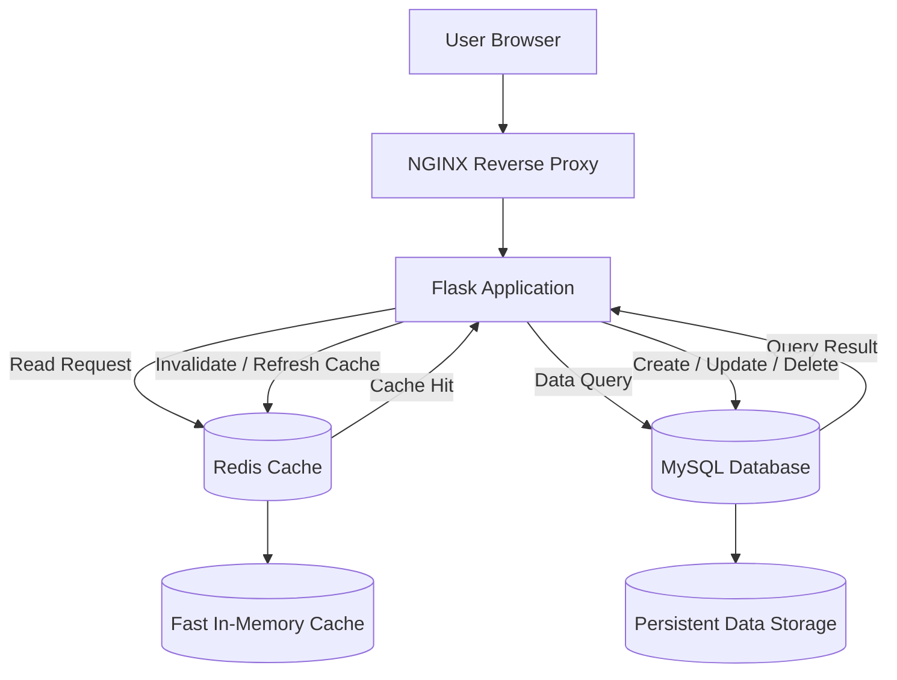

# Flask CRUD Application

A production-ready containerized web application. The project combines Flask, MySQL, Redis, and Nginx to deliver a lightweight CRUD experience with caching and container-based deployment support.

## Project Title

Flask CRUD Application

## Architecture Diagram



### End to End flow explanation

- The user interacts with the application through a browser.
- NGINX acts as the entry point and forwards incoming requests to the Flask app.
- The Flask application contains the business logic, request handlers, and CRUD operations.
- Redis is used as a fast in-memory cache for frequently accessed read operations.
- MySQL stores the authoritative phonebook records permanently.
- On read requests, Flask checks Redis first. If the data is not cached, it queries MySQL.
- On write requests such as create, update, or delete, Flask updates MySQL and then refreshes or invalidates the relevant Redis entry.
- This layered approach improves speed, reliability, and separation of concerns.

## Features

- Create, read, update, and delete phonebook entries
- Responsive web interface for managing contacts
- MySQL-backed persistent storage
- Redis-based caching for faster read operations
- Nginx as a reverse proxy for clean request routing
- Docker Compose support for quick local deployment
- Container-friendly architecture for cloud deployment

## Tech Stack

- Python
- Flask
- PyMySQL
- MySQL
- Redis
- Nginx
- Docker
- Compose
- Kubernetes
- Helm
- GitHub Actions
- Trivy
- SonarQube
- Snyk
- Dependabot

## Repository Structure

```text
.
├── compose.yaml
├── Dockerfiles/
│   ├── app/
│   ├── mysql/
│   └── nginx/
├── database/
│   └── flaskmysql.sql
├── source_code/
│   ├── module/
│   │   ├── database.py
│   │   └── redis_client.py
│   ├── requirements.txt
│   ├── server.py
│   ├── static/
│   └── templates/
├── README.md
└── sonar-project.properties
```

## Application Flow

1. User requests data from the browser.
2. NGINX forwards the request to Flask.
3. Flask checks Redis for cached results.
4. If missing, Flask reads from MySQL.
5. For writes, Flask updates MySQL and refreshes the cache.
6. The result is returned to the user.

## Prerequisites

Before running the project, ensure you have:

- Docker Desktop or Docker Engine installed
- Docker Compose v2
- Git
- A terminal with access to the Docker daemon


## Local Development

The recommended approach is to run the application with Docker Compose, as it automatically starts the Flask app, MySQL database, Redis cache, and Nginx proxy together.

### Step 1: Clone the repository

```bash
git clone <repository-url>
cd Flask-app-deployment
```

### Step 2: Build and start the services

```bash
docker compose up --build -d
```

This command will start:

- Flask app on port 8181
- MySQL on port 3306
- Redis on port 6379
- Nginx on port 80

### Step 3: Open the application

Use one of the following URLs:

- http://localhost for the Nginx-proxied application
- http://localhost:8181 for direct access to the Flask app

### Step 4: Stop or clean up the containers

```bash
docker compose down
```

To remove stored data as well:

```bash
docker compose down -v
```

> Docker Compose is the easiest and most reliable option for local development because it keeps the full stack consistent.

## Docker

This repository includes containerized services for:

- Flask application
- MySQL database
- Redis cache
- Nginx reverse proxy

### Build and run

```bash
docker compose up --build -d
```

### Useful Docker commands

```bash
docker compose ps
docker compose logs -f
docker compose down -v
```

## CI/CD Pipeline

A typical CI/CD workflow for this project should include:

1. Trigger on pushes to main or release branches
2. Build Docker images for the Flask app and Nginx layer
3. Run tests or basic validation checks
4. Push images to a container registry such as Docker Hub or Azure Container Registry
5. Deploy to staging or production using Kubernetes or Helm

Example GitHub Actions stages:

- checkout
- setup Python
- install dependencies
- build Docker images
- push images
- deploy with kubectl or helm

## Security

- Trivy – Scan Docker images for known CVEs and security issues before deployment
- SonarQube – Analyze source code for bugs, code smells, and security hotspots
- Snyk – Monitor application dependencies for vulnerabilities and suggest fixes
- Dependabot – Automatically create pull requests for outdated dependencies

### Recommended practices

- Store secrets in Kubernetes Secrets, Docker secrets, or a secure secret manager
- Avoid hard-coded credentials in application code
- Enable HTTPS with TLS termination at the ingress or reverse proxy layer
- Restrict database access to only the application services that need it
- Use non-root containers where possible
- Keep base images and Python packages updated regularly
- Scan container images and dependencies for vulnerabilities before deployment

## License

This project is distributed under the repository license provided in the project root.
